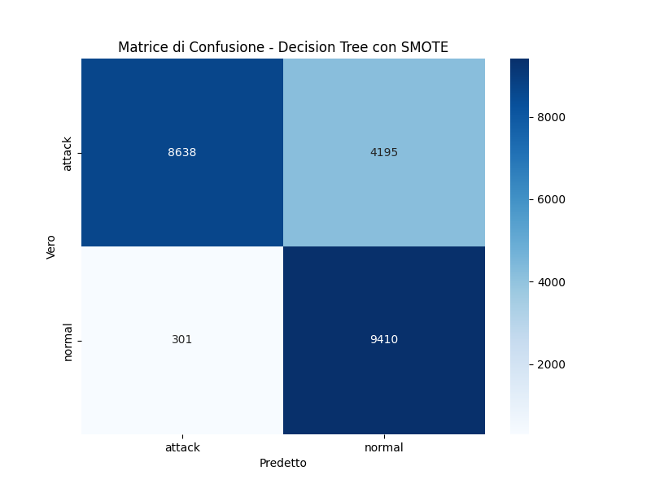
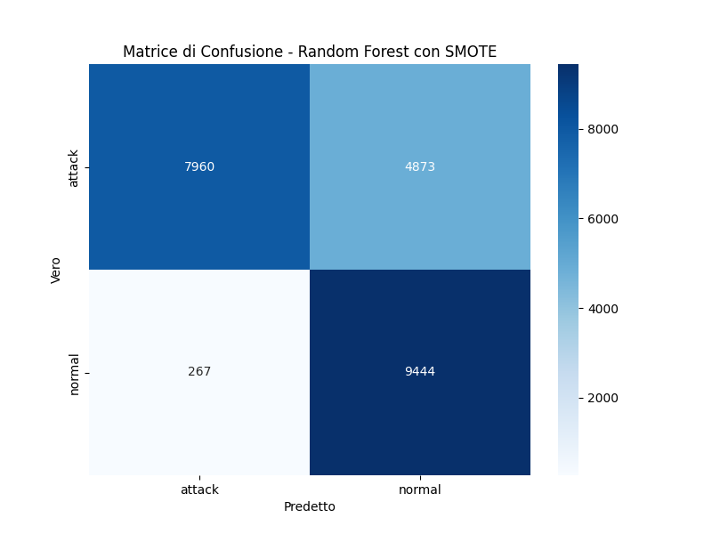

# Progetto: Rilevamento delle Intrusioni (IDS) con Machine Learning

**Autore:** Filippo Zullo

---

### Indice
- [Introduzione](#introduzione)
- [Dataset](#dataset)
- [Metodologia](#metodologia)
- [Risultati e Analisi](#risultati-e-analisi)
- [Conclusioni](#conclusioni)
- [Come Eseguire il Codice](#come-eseguire-il-codice)

---

### Introduzione

Questo progetto mira a sviluppare un Sistema di Rilevamento delle Intrusioni (IDS) binario utilizzando algoritmi di Machine Learning (Decision Tree e Random Forest) sul dataset NSL-KDD. L'obiettivo è classificare il traffico di rete come `normal` o `attack`, valutando le performance di diversi modelli e l'impatto di tecniche di pre-elaborazione come l'oversampling (SMOTE) e l'ottimizzazione degli iperparametri (GridSearchCV).

### Dataset

Il dataset utilizzato è l'**NSL-KDD**, una versione raffinata del popolare dataset KDD Cup 99. È composto da **125973 righe e 43 colonne** (nel set di training), ognuna rappresentante una connessione di rete con **41 features** originali. Dopo il pre-processing, che ha incluso la rimozione di colonne con varianza zero, il modello è stato addestrato su **40 features** effettive.

Per questo progetto, abbiamo convertito il problema di classificazione multi-classe in un problema binario, raggruppando tutti i tipi di attacco in una singola categoria `attack`.

**Distribuzione delle Classi nel Training Set:**
- `normal`: **67343**
- `attack`: **58630**

### Metodologia

La pipeline di Machine Learning è stata implementata in Python utilizzando librerie come `pandas`, `scikit-learn` e `imblearn`. I passaggi principali includono:

1.  **Pre-Elaborazione Dati:**
    - `StandardScaler` per la normalizzazione delle features numeriche.
    - `OneHotEncoder` per la codifica delle features categoriche.
    - Rimozione di features con varianza zero (e.g., `num_outbound_cmds`).

2.  **Addestramento dei Modelli:**
    - Abbiamo addestrato e valutato due modelli: **Decision Tree** e **Random Forest**.
    - Per affrontare il leggero sbilanciamento delle classi, abbiamo confrontato le performance dei modelli **con e senza l'applicazione di SMOTE** (Synthetic Minority Over-sampling Technique) per bilanciare il training set.

3.  **Ottimizzazione degli Iperparametri:**
    - Abbiamo utilizzato `GridSearchCV` per trovare la migliore combinazione di iperparametri per il modello **Random Forest con SMOTE**, focalizzandoci sul miglioramento dell'**F1-score**.

### Risultati e Analisi

#### **Confronto dei Modelli (Accuracy)**

| Modello | Tecnica | Accuratezza |
| :--- | :--- | :--- |
| Decision Tree | Senza SMOTE | **0.8119** |
| Decision Tree | Con SMOTE | **0.8005** |
| Random Forest | Senza SMOTE | **0.7780** |
| Random Forest | Con SMOTE | **0.7720** |
| Random Forest | GridSearchCV Ottimizzato | **0.7714** |

#### **Analisi dell'Impatto di SMOTE**

L'applicazione di SMOTE ha mostrato un leggero calo dell'accuratezza complessiva, ma ha avuto un effetto positivo sul **recall** per la classe `attack`. Questo è un trade-off accettabile in un IDS, dove l'identificazione di un attacco (alto `recall`) è spesso più critica della precisione complessiva.

* **Classification Report (Decision Tree con SMOTE):**
    ```
                  precision      recall      f1-score      support      
        attack      0.97          0.67        0.79          12833            
        normal      0.69          0.97        0.81           9711

     accuracy                                 0.80          22544
     macro avg      0.83          0.82        0.80          22544
     weighted avg   0.85          0.80        0.80          22544
    ```

* **Classification Report (Random Forest con SMOTE):**
  ```
                  precision      recall      f1-score      support      
        attack      0.97          0.62        0.76          12833           
        normal      0.66          0.97        0.79           9711

     accuracy                                 0.77          22544
     macro avg      0.81          0.80        0.77          22544
     weighted avg   0.83          0.77        0.77          22544
       
    ```

* **Matrici di Confusione (Modelli con SMOTE):**
    
    

#### **Analisi dell'Ottimizzazione con GridSearchCV**

L'ottimizzazione degli iperparametri tramite `GridSearchCV` ha identificato i seguenti parametri ottimali per il Random Forest:
- **Migliori Parametri:** `{'classifier__max_depth': None, 'classifier__min_samples_split': 2, 'classifier__n_estimators': 200}`
- **Miglior F1-score (Cross-Validation):** `0.9989981544418071`

Nonostante un F1-score quasi perfetto in fase di cross-validation, l'accuratezza finale sul test set non è migliorata in modo significativo. Questo indica un potenziale **overfitting** del modello sul training set e sui dati sintetici generati da SMOTE.

* **Matrice di Confusione (Miglior Modello Random Forest Ottimizzato):**
    

### Conclusioni 
I risultati di questo progetto dimostrano che sia il Decision Tree che il Random Forest sono in grado di ottenere buone performance nella classificazione del traffico di rete.

L'applicazione di SMOTE ha avuto un impatto significativo, specialmente sul recall per la classe attack. Questo è un aspetto cruciale per un Sistema di Rilevamento delle Intrusioni, poiché l'obiettivo principale è minimizzare i falsi negativi (attacchi non rilevati), anche a costo di una leggera diminuzione dell'accuratezza complessiva. 
Il trade-off tra l'alta precisione della classe attack (che indica che le nostre previsioni di attacco sono affidabili) e il recall (che misura la nostra capacità di rilevare tutti gli attacchi) è stato gestito efficacemente.
L'ottimizzazione degli iperparametri tramite GridSearchCV ha rivelato che il modello Random Forest con parametri predefiniti era già molto efficiente. 
L'analisi ha anche evidenziato un potenziale overfitting, suggerito dall'alto F1-score in cross-validation rispetto all'accuratezza sul set di test.


### Come Eseguire il Codice

1.  **Clonare il Repository:** Apri un terminale ed esegui il seguente comando per clonare il progetto:
    ```bash
    git clone [https://github.com/filippo-zullo98/IDS-NSL-KDD-Project-ProgettoIcon25-.git](https://github.com/filippo-zullo98/IDS-NSL-KDD-Project-ProgettoIcon25-.git)
    cd IDS-NSL-KDD-Project
    ```
2.  **Installare le Dipendenze:** Assicurati di avere `pip` installato e installa tutte le librerie necessarie tramite il file `requirements.txt`:
    ```bash
    pip install -r requirements.txt
    ```
3.  **Dataset:** Scarica i file `KDDTrain+.txt` e `KDDTest+.txt` e posizionali nella stessa directory dello script.
4.  **Esecuzione:** Apri un terminale nella directory del progetto ed esegui il comando:
    ```bash
    python ids_classifier.py
    ```

---
