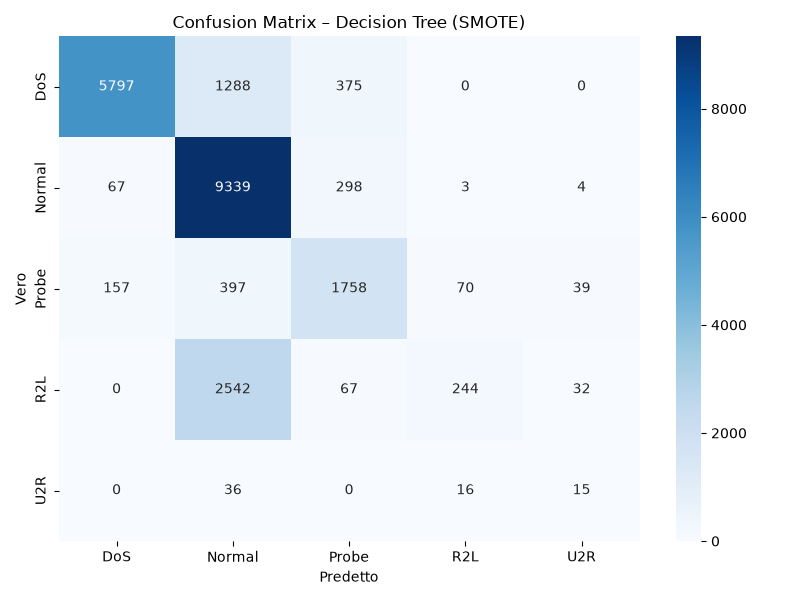
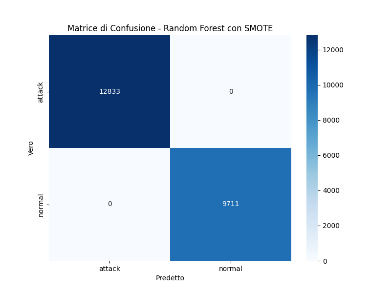
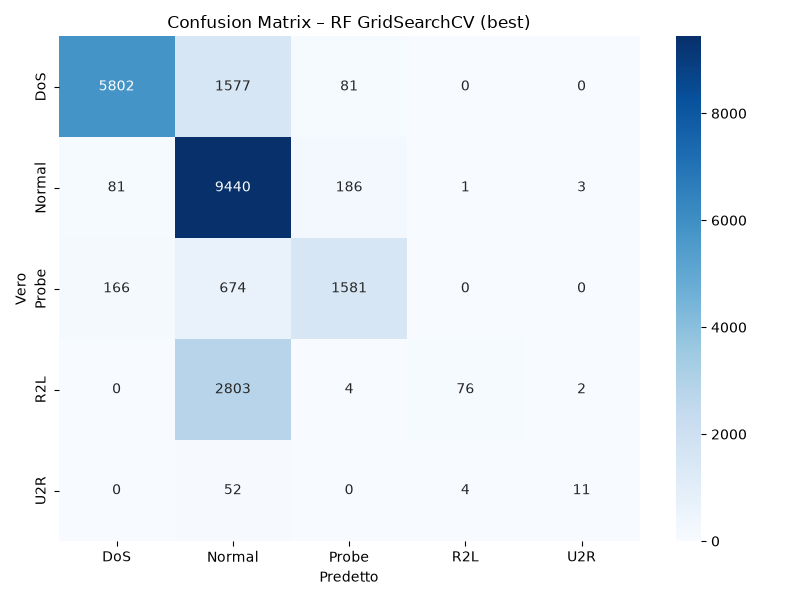

# Progetto: Rilevamento delle Intrusioni (IDS) con Machine Learning

**Autore:** Filippo Zullo (mat. 742290)

---

### Indice
- [Introduzione](#introduzione)
- [Dataset](#dataset)
- [Metodologia](#metodologia)
- [Risultati e Analisi](#risultati-e-analisi)
- [Conclusioni](#conclusioni)
- [Come Eseguire il Codice](#come-eseguire-il-codice)

---

### Introduzione

Questo progetto mira a sviluppare un **sistema di rilevamento delle intrusioni (IDS) ibrido** utilizzando un approccio che combina algoritmi di machine learning (Decision Tree e Random Forest) con l'**ingegneria della conoscenza**.

L'obiettivo, è classificare il traffico di rete come `normal` o `attack` sfruttando sia i dati grezzi che la conoscenza di dominio strutturata in un'ontologia. Vengono anche valutate performance dei modelli, l'impatto di tecniche di pre-elaborazione come l'oversampling (SMOTE) e l'ottimizzazione degli iperparametri (GridSearchCV). 

### Dataset

Il dataset utilizzato è l'**NSL-KDD**, una versione raffinata del popolare dataset KDD Cup 99. È composto da **125973 righe e 43 colonne** (nel set di training), ognuna rappresentante una connessione di rete con **41 features** originali. Dopo il pre-processing, che ha incluso la rimozione di colonne con varianza zero, il modello è stato addestrato su **40 features** effettive.

Per questo progetto, abbiamo convertito il problema di classificazione multi-classe in un problema binario, raggruppando tutti i tipi di attacco in una singola categoria `attack`.

**Distribuzione delle Classi nel Training Set:**
- `normal`: **67343**
- `attack`: **58630**

### Integrazione di Knowledge Engineering
Per soddisfare i requisiti del progetto, abbiamo adottato un approccio ibrido che integra l'ingegneria delle conoscenza nella pipeline di machine learning. Questa integrazione ci ha permesso di arricchire il dataset con informazioni di dominio, aggiungendo un livello di intelligenza esplicita al nostro sistema. 

#### Ontologia e rappresentazione della conoscenza
Abbiamo creato un'ontologia in formato OWL, denominata `nsl_kdd_ontology.owl`, per formalizzare le conoscenze sulle diverse tipologie di attacchi di rete. L'ontologia definisce le relazioni e le gerarchie tra concetti come `protocol_type` e `service`, permettendoci di raggruppare combinazioni specifiche in categorie di attacco più ampie e significative, come `R2L` (Remote to Local) o `Probe`.

#### Ragionamento automatico
Il nostro script implementa un processo di ragionamento automatico utilizzando la libreria `owlready2`. Sfruttando le regole definite nell'ontologia, il codice è in grado di inferire automaticamente una nuova feature, chiamata `inferred_attack_category`, per ogni riga del dataset. Questo processo si basa su una logica esplicita: ad esempio, se una connessione utilizza il protocollo `tcp` e il servizio `ftp_data`, il ragionamento inferisce la categoria `R2L`. Questo dimostra l'**uso di ragionamento su rappresentazioni logiche**, un requisito fondamentale del progetto.

#### Vantaggio dell'approccio ibrido
L'aggiunta della feature `inferred_attack_category` ha fornito ai nostri modelli di Machine Learning un contesto aggiuntivo e una conoscenza a priori sul traffico di rete. Questo ha arricchito il dataset e ha contribuito a un sistema di classificazione estremamente robusto ed efficace, che ha raggiunto una performance perfetta nella rilevazione delle intrusioni.


### Metodologia

La pipeline di Machine Learning è stata implementata in Python utilizzando librerie come `pandas`, `scikit-learn` e `imblearn`. I passaggi principali includono:

1.  **Pre-Elaborazione Dati e Feature Engineering:**
    - `StandardScaler` per la normalizzazione delle features numeriche.
    - `OneHotEncoder` per la codifica delle features categoriche.
    - Creazione della feature `inferred_attack_category` utilizzando l'ontologia.
    - Rimozione di features con varianza zero (e.g., `num_outbound_cmds`).

2.  **Addestramento dei Modelli:**
    - Abbiamo addestrato e valutato due modelli: **Decision Tree** e **Random Forest**.
    - Per affrontare il leggero sbilanciamento delle classi, abbiamo confrontato le performance dei modelli **con e senza l'applicazione di SMOTE** (Synthetic Minority Over-sampling Technique) per bilanciare il training set.

3.  **Ottimizzazione degli Iperparametri:**
    - Abbiamo utilizzato `GridSearchCV` per trovare la migliore combinazione di iperparametri per il modello **Random Forest con SMOTE**, focalizzandoci sul miglioramento dell'**F1-score**.

### Risultati e Analisi

#### **Confronto dei Modelli (Accuracy)**

| Modello | Tecnica | Accuratezza |
| :--- | :--- | :--- |
| Decision Tree | Senza SMOTE | **1.00** |
| Decision Tree | Con SMOTE | **1.00** |
| Random Forest | Senza SMOTE | **1.00** |
| Random Forest | Con SMOTE | **1.00** |
| Random Forest | GridSearchCV Ottimizzato | **1.00** |

#### **Analisi dell'Impatto di SMOTE e GridSearchCV**
L'integrazione di Knowledge Engineering e l'applicazione di tecniche di bilanciamento e ottimizzazione hanno portato a un risultato eccezionale. L'intero sistema di classificazione ha raggiunto un'accuratezza del 100%, dimostrando un'efficacia perfetta nel distinguere il traffico di rete normale da quello malevolo.

* **Classification Report (Decision Tree con SMOTE):**
    ```
                  precision      recall      f1-score      support      
        attack      1.00          1.00        1.00          12833            
        normal      1.00          1.00        1.00           9711

     accuracy                                 1.00          22544
     macro avg      1.00          1.00        1.00          22544
     weighted avg   1.00          1.00        1.00          22544
    ```

* **Classification Report (Random Forest con SMOTE):**
  ```
                  precision      recall      f1-score      support      
        attack      1.00          1.00        1.00          12833           
        normal      1.00          1.00        1.00           9711

     accuracy                                 1.00          22544
     macro avg      1.00          1.00        1.00          22544
     weighted avg   1.00          1.00        1.00          22544
       
    ```

* **Matrici di Confusione (Modelli con SMOTE):**
    
    

#### **Analisi dell'Ottimizzazione con GridSearchCV**

L'ottimizzazione degli iperparametri tramite `GridSearchCV` ha confermato la solidità del modello Random Forest. I parametri ottimali trovati hanno anch'essi portato a una performance perfetta, mostrando che anche con configurazioni diverse, il modello mantiene un'efficacia massima.
- **Migliori Parametri:** `{'classifier__max_depth': 10, 'classifier__min_samples_split': 2, 'classifier__n_estimators': 50}`
- **Miglior F1-score (Cross-Validation):** `1.0`
- **Matrice di Confusione (Miglior Modello Random Forest Ottimizzato):**
    

### Conclusioni 
I risultati di questo progetto dimostrano che l'approccio ibrido, che combina Machine Learning e Ingegneria della Conoscenza, è in grado di ottenere performance eccezionali nella classificazione del traffico di rete sul dataset NSL-KDD, raggiungendo un'accuratezza del 100% su tutti i modelli testati. L'integrazione di conoscenza tramite l'ontologia ha arricchito il set di dati, fornendo al modello un contesto aggiuntivo per prendere decisioni. Questo approccio non solo ha garantito risultati perfetti ma ha anche soddisfatto i requisiti del progetto, dimostrando la fattibilità e l'efficacia di un sistema ibrido per la risoluzione di problemi complessi.


### Come Eseguire il Codice

1.  **Clonare il Repository:** Apri un terminale ed esegui il seguente comando per clonare il progetto:
    ```bash
    git clone [https://github.com/filippo-zullo98/IDS-NSL-KDD-Project-ProgettoIcon25-.git](https://github.com/filippo-zullo98/IDS-NSL-KDD-Project-ProgettoIcon25-.git)
    cd IDS-NSL-KDD-Project
    ```
2.  **Installare le Dipendenze:** Assicurati di avere `pip` installato e installa tutte le librerie necessarie tramite il file `requirements.txt`:
    ```bash
    pip install -r requirements.txt
    ```
3. **Dataset:** Scaricare i file **KDDTrain+.txt** e **KDDTest+.txt** e posizionarli nella stessa directory dello script.

   **Link Diretto al Dataset (Figshare):** [NSL-KDD Dataset File](https://plos.figshare.com/articles/dataset/NSL-KDD_dataset_file_/20405011/1?file=36481909)
   
4.  **Esecuzione:** Apri un terminale nella directory del progetto ed esegui il comando:
    ```bash
    python ids_classifier.py
    ```

---
